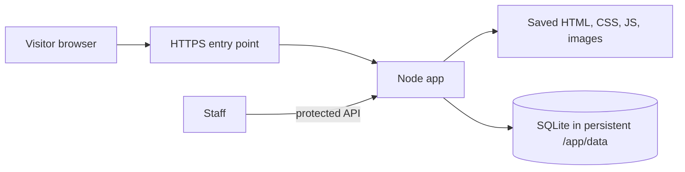

# Filfil site: learning and deployment journal

Last updated: 2026-09-17. This is a working notebook, not a claim that production is ready. We will add the output and lesson from each deployment step as we go. Do not put passwords, admin tokens, or private customer submissions in this file.

## What we have today

- The public site has been captured in `filfil-site/`. The latest mirror report lists **192 URL records**, mapping to **160 distinct saved HTML paths**, and **265 reported assets**. Some URLs differ only by a trailing slash and save to the same file.
- Recipe, magazine, and product “more” buttons work locally. Their full lists contain **86 recipes**, **37 articles**, and **19 products**. `static-list-report.json` shows no missing detail pages or list assets.
- `mirror-report.json` still records **20 source failures**: `/faqs/` returned HTTP 500, and 19 asset URLs returned HTTP 404, mostly fonts and a few icons/map images. These failures do not mean the whole capture failed.
- `Dockerfile` serves the read-only snapshot with Nginx. `Dockerfile.app` serves it through the Node backend and a fresh SQLite database in `/app/data`.
- The Node backend was tested locally with a temporary database: homepage, Persian search, contact form in a browser, product ratings, career attachment storage, and protected submission retrieval. The Docker image has **not** been built or tested here because this workspace cannot access the Docker socket.
- We have reviewed production host output supplied over SSH by the user, including Docker, Caddy, mounts, networking, and the existing Python app's startup command. This assistant has not connected to the server. The user has now supplied successful image-build output: **`filfil:initial`, image ID `1840803c1370`**. Container startup, backups, HTTPS, and DNS cutover remain unverified. The local repo is tracked in Git; the journal has uncommitted edits.
- The user reports uploading all project files and folders to **`/home/data/filfil`** on the server. Use that path for subsequent server commands. The next steps are private token creation, Compose validation, and the first private start.

## Mental model



The browser needs pages and assets to **view** the site. Submitting a form needs server code to receive and validate it. SQLite is where that code stores new records. A database alone does not make a form work. The HTTPS entry point handles certificates and forwards requests; DNS tells browsers which server to contact.

## Reverse proxies: Caddy and Nginx vocabulary

A **reverse proxy** is a public-facing web server that receives a visitor's HTTP or HTTPS request and forwards it to a private application server. “Reverse” describes its position: it stands in front of servers, whereas a normal browser proxy stands in front of a client.

```text
Browser ── HTTPS ──> reverse proxy ── private HTTP ──> application
                      Caddy or Nginx                  Node app
```

The proxy owns public ports 80 and 443. The application can listen only on a Docker network. This gives one place to manage domains, TLS certificates, HTTP-to-HTTPS redirects, request size limits, access logs, and routing. It also means an app does not need permission to bind privileged ports or understand certificates.

### Concepts that transfer directly

| Concept | Meaning | Caddy spelling | Nginx spelling |
| --- | --- | --- | --- |
| Site block | Rules for one domain or listener | `filfilworld.com { ... }` | `server { server_name filfilworld.com; ... }` |
| Public listener | Which address/port accepts visitors | Usually implied by the domain, or `:80` | `listen 80;` / `listen 443 ssl;` |
| Upstream | The private app receiving forwarded requests | `reverse_proxy filfil-app:8080` | `proxy_pass http://filfil-app:8080;` |
| Docker service name | Stable internal name resolved by Docker DNS | `filfil-app` | `filfil-app` |
| TLS termination | Proxy handles HTTPS; app usually receives plain HTTP privately | Automatic for a real public domain | Certificate and key configured explicitly |
| Host routing | Domain selects the correct site/app | Domain at the start of a Caddy block | `server_name` inside a `server` block |
| Path routing | URL path selects a different upstream or behavior | `handle /api/* { ... }` | `location /api/ { ... }` |
| Forwarded request details | App receives original host/protocol/client information in headers | Caddy forwards standard proxy headers by default | Configure `proxy_set_header` values intentionally |

The syntax differs, but the request path is the same:

```text
filfilworld.com → Caddy site block → reverse_proxy → filfil-app:8080
filfilworld.com → Nginx server block → proxy_pass    → filfil-app:8080
```

### Caddy-specific observations

- A real public domain in a Caddy site block normally triggers automatic HTTPS certificate issuance and renewal. Default HTTP/TLS validation requires the certificate authority's challenge requests to reach this Caddy instance through the domain. DNS validation is another option: it can obtain a certificate before changing the website's A/AAAA records, but needs control of DNS and appropriate Caddy support. We must choose that method before promising HTTPS on the final hostname ahead of cutover. [Caddy automatic HTTPS](https://caddyserver.com/docs/automatic-https)
- `:80` is an HTTP listener without a hostname restriction. It can coexist with more specific domain routes; requests unmatched by those routes may reach this catch-all. Keep the existing application's route in mind when adding Filfil.
- Caddy's `reverse_proxy app:8090` resolves `app` using Docker's internal DNS when both containers share a Docker network.

### Nginx-specific observations

- Nginx uses the same reverse-proxy architecture, but certificate paths, HTTPS settings, and most forwarded headers are declared more explicitly.
- `proxy_pass` is the Nginx equivalent of Caddy's `reverse_proxy`.
- Nginx can run directly on the host or in Docker. If it runs in Docker, the same network and service-name rules apply.

### Useful questions when reading either configuration

1. Which domains does this block accept?
2. Does it listen on HTTP, HTTPS, or both?
3. Where is TLS terminated, and how are certificates renewed?
4. Which private service and port receive the proxied request?
5. Are proxy and application on the same Docker network?
6. What happens for an unknown domain, a large upload, or an unhealthy app?

The answer to these questions matters more than memorizing Caddyfile or Nginx syntax. A configuration language is a way of expressing the same traffic-routing decisions.

## Questions we resolved

| Earlier hypothesis or question | What the evidence showed | Practical lesson |
| --- | --- | --- |
| “I need the WordPress password to keep this site.” | The public HTTP endpoint reports an ASP.NET powered origin behind ArvanCloud. We cannot prove the entire origin setup from a header, but a WordPress login is not needed to serve a public snapshot. | Domain control and a copy of public content can replace the public site; neither recovers private source code or data. |
| “Downloading every page means every button works.” | The three “more” buttons called server endpoints. They returned 404 from a static file server until their responses were captured and the buttons were changed to reveal saved cards. | Audit actions as well as links when mirroring a dynamic site. |
| “`pnpm` exit code 1 means the download was lost.” | The crawler saved files and then exited nonzero because some individual requests failed. | Read `filfil-site/mirror-report.json`; distinguish the job's exit status from the amount of usable content. |
| “A Node or Flask server plus a DB automatically restores the old website.” | Old forms depended on search, comment, career, partner, rating, and CAPTCHA endpoints. | Each required behavior needs code. The new Node app implements fresh submissions and search, but does not recreate the old database. |
| “SQLite may be too small for a business website.” | This is a mostly read-only brand site with occasional lead submissions. SQLite documents low/medium-traffic websites as a good fit; it permits many readers but one writer at a time. | One app instance with SQLite on local persistent storage is reasonable here. Reconsider if multiple servers must write the same DB. [SQLite guidance](https://www.sqlite.org/whentouse.html) |
| “Building a container preserves its database.” | Container writable layers are disposable; a volume persists independently of the container. | Mount persistent storage at `/app/data` and test a restart. [Docker storage guide](https://docs.docker.com/engine/storage/) |
| “HTTPS and DNS are the same step.” | HTTPS is configured on the serving side; DNS only points a name to an address. | Test the app, storage, backups, and HTTPS before switching DNS. |

## Still incomplete or intentionally different

- New submissions are stored, but there is no staff inbox or email notification. Staff can use the protected API. For B2B leads, decide who checks it and how often before public launch.
- New product comments are saved privately; they are not published into the archived comment area. There is no moderation interface.
- The old career dynamic-field endpoint has an empty replacement, and the partner city dropdown is replaced with a free-text city field in the Node app.
- Spam controls are basic. The old CAPTCHA is not reused. Forms should be exercised on the production hostname before inviting real traffic.
- The submission limiter currently keys requests by `req.socket.remoteAddress` in `server.js`. Behind Caddy this normally identifies the proxy, so visitors would share its limit of eight attempts per minute. Before launch, configure and test how the app obtains client addresses from a trusted proxy. Simply accepting arbitrary client-supplied forwarding headers would allow bypassing the limit.
- The `/faqs/` failure and source 404 assets are unresolved. Review their visible impact rather than assuming they are all critical.
- The static Nginx container does **not** process forms or search. Use the Node app container if those features matter.

## Deployment learning path

Complete one stage at a time. Record the actual result below before moving to the next stage.

1. [x] **Inventory the host.** Ubuntu 26.04.1, Docker 29.1.3, and Compose 2.40.3 are present. Docker publishes ports 80/443 through the `competition-ghore-caddy-1` Caddy container. Docker is enabled. Every listed running container has `unless-stopped` or `always`, so it should return after a reboot unless it had been manually stopped. Plan a maintenance window; do not assume zero downtime.
2. [ ] **Prepare the app.** Transfer the required files, prepare a separate Filfil Compose project, then build and run `Dockerfile.app` privately; confirm homepage and forms. Resolve the proxy/client-address issue before public launch.
3. [ ] **Persist SQLite.** Mount a local Docker volume at `/app/data`; submit a test record; recreate the container; confirm the record survives.
4. [ ] **Set the admin secret.** Provide a long random `FILFIL_ADMIN_TOKEN` without committing it to Git or putting it in this journal. Confirm the protected API rejects an unauthenticated request.
5. [ ] **Back up and restore.** Make a consistent SQLite backup, restore it into a separate test location, and read the test record there. A backup is proven only after a restore test. [SQLite backup guidance](https://www.sqlite.org/backup.html)
6. [ ] **Add HTTPS.** Use the existing Caddy. Choose how to validate certificates before cutover: a test subdomain can prove the setup, while testing a valid certificate for the final hostname before its A/AAAA change needs a method such as DNS validation. A test subdomain alone does not prove the final hostname's certificate.
7. [ ] **Review business flows.** Submit test contact, partner, career, comment, and search requests. Decide how staff will see wholesale leads.
8. [ ] **Switch DNS.** Point the domain only after the new path works. Verify from outside the server, then keep a rollback path to the old destination during the transition.

### Step 1: host inventory in progress

Run on the intended production server over SSH:

```sh
cat /etc/os-release
docker version --format 'Docker server: {{.Server.Version}}'
docker compose version
sudo ss -ltnp '( sport = :80 or sport = :443 )'
```

These are read-only. An error is useful evidence too: for example, “permission denied” for Docker differs from “Docker is not installed.” Record the results below, omitting secrets.

The first run showed Ubuntu 26.04.1 LTS, Docker Engine 29.1.3, and Docker Compose 2.40.3. Ports 80 and 443 are held by `docker-proxy` on IPv4 and IPv6. The follow-up identified `competition-ghore-caddy-1` as the container publishing them. The login banner also says a reboot is required. We have not rebooted.

Read-only follow-up before planning any reboot:

```sh
cat /run/reboot-required.pkgs 2>/dev/null || true
uname -r
systemctl is-enabled docker
docker ps --format 'table {{.Names}}\t{{.Status}}\t{{.Ports}}'
docker ps -q | xargs -r docker inspect --format '{{.Name}} restart={{.HostConfig.RestartPolicy.Name}}'
```

Ubuntu's reboot marker says an installed package wants a reboot to finish applying; zero pending package updates does not erase that requirement. Here it lists `linux-image-7.0.0-30-generic` and `linux-image-7.0.0-31-generic`, while `uname -r` reports the older running kernel `7.0.0-15-generic`. A reboot is therefore required to start the new kernel. `libc6` also commonly requires process restarts. A host reboot stops all containers for the duration. Docker is enabled, and all listed containers have `unless-stopped` or `always`; they should return when Docker starts after the host boots, unless an `unless-stopped` container was manually stopped before the reboot. Check the actual policies before choosing a maintenance window. [Ubuntu update guidance](https://ubuntu.com/blog/ubuntu-updates-best-practices-for-updating-your-instance), [Docker restart policies](https://docs.docker.com/engine/containers/start-containers-automatically/).

## Step log

### 2026-09-16 — Host inventory, first pass

- **Expected:** Identify the server environment and current HTTP/HTTPS listener.
- **Observed:** Ubuntu 26.04.1 LTS; Docker 29.1.3; Compose 2.40.3; `docker-proxy` listening on 80/443 for IPv4 and IPv6. Login banner says restart required; no package updates currently pending.
- **What I revised:** “Restart required” means a package requested a reboot, not that we should reboot immediately. Docker being installed does not prove its containers will recover automatically.
- **Next:** Identify the affected packages, running containers, and their restart policies. Do not reboot during this learning step.

### 2026-09-16 — Host inventory, reboot assessment

- **Observed:** The reboot marker names newer Linux kernels 7.0.0-30 and 7.0.0-31 plus `libc6`; the running kernel is 7.0.0-15. Docker starts at boot. All 24 listed running containers use `unless-stopped`, except `bi-site-1`, which uses `always`. Caddy container `competition-ghore-caddy-1` owns the public 80/443 ports.
- **What I learned:** A reboot is an operating-system interruption. Docker restart policies preserve availability after boot; they do not keep containers running through the reboot. `unless-stopped` means restart after Docker restarts unless someone deliberately stopped that container; `always` starts again even after an earlier manual stop when Docker starts.
- **Next:** Pick a maintenance window only after checking the services' data persistence and the Caddy configuration. The Filfil deployment should join the existing Caddy routing rather than bind 80/443 itself.

### Step 2: pending Caddy inspection

The public request path is `visitor → host port 80/443 → Docker port mapping → Caddy container → app container`. Caddy is inside Docker, but remains the public entry point because its container publishes the host's 80/443 ports. We need to inspect its configuration, attached Docker networks, and mounts before adding a new route.

Run only these read-only commands on the server. They deliberately do not print the container's environment variables, since those can contain secrets:

```sh
docker inspect competition-ghore-caddy-1 --format 'project_dir={{index .Config.Labels "com.docker.compose.project.working_dir"}} project={{index .Config.Labels "com.docker.compose.project"}}'
docker inspect competition-ghore-caddy-1 --format '{{range .Mounts}}{{println .Type .Source "->" .Destination}}{{end}}'
docker inspect competition-ghore-caddy-1 --format '{{range $name, $network := .NetworkSettings.Networks}}{{println $name}}{{end}}'
docker exec competition-ghore-caddy-1 caddy version
docker exec competition-ghore-caddy-1 sh -c 'find /etc/caddy -maxdepth 2 -type f -print'
```

Then open the Caddyfile using the path shown by `find` and run `sed -n '1,260p' PATH_TO_CADDYFILE`. Before pasting it here, redact any passwords, API keys, DNS-provider tokens, or private upstream addresses if present. Normally a Caddyfile contains only public domains and reverse-proxy targets.

### 2026-09-16 — Caddy inspection, first pass

- **Observed:** The Compose project is `competition-ghore`; its project directory is `/home/competition-ghore`. Caddy is version `v2.11.4`. Its Caddyfile is a bind mount from the host path `/home/competition-ghore/Caddyfile` to the container path `/etc/caddy/Caddyfile`. It uses named Docker volumes for `/data` and `/config`, and is attached to the named network `competition-ghore_default`.
- **What this means:** `docker inspect --format` looks complicated because Docker normally stores each container's full configuration as a large JSON document. The command extracts two labels from that document: the Compose project name and the directory that launched it. It did not change anything.

  A **bind mount** links one specific host path directly into a container. Therefore `/home/competition-ghore/Caddyfile` is the real configuration file on the server; Caddy sees that same file at `/etc/caddy/Caddyfile` inside its container. A **named volume** is Docker-managed persistent storage. Caddy's `/data` volume generally holds certificates and related state; `/config` holds Caddy runtime configuration. Do not remove either volume.

  `competition-ghore_default` is a normal, human-readable Docker network name created by Compose. Think of it as a private virtual LAN. Containers on it can reach each other by service/container name using Docker's internal DNS. The network has IP addresses internally, but using an app name is intentional: addresses can change when containers are recreated. The future Filfil app should join this network; Caddy can then proxy to a name such as `filfil-app:8080` without publishing Filfil's port to the internet.

  `v2.11.4` is the Caddy software version. The long `h1:...` string is a build checksum/identifier, useful for verifying exactly which build is installed. We only needed the version to know which configuration syntax and behavior we are working with. It is not a password or a secret.

  `docker exec ... /etc/caddy/Caddyfile` runs the command **inside the Caddy container**. Its result is the same host file in this case because the host Caddyfile is bind-mounted there.

- **Safe sharing habit:** Before sharing any configuration file, look for values that let someone authenticate as you or change external systems: passwords, `token=`, `api_key=`, `secret=`, private keys, or DNS-provider credentials. Replace the value with `[REDACTED]`, preserving the setting name and surrounding structure. Domains, service names, ports, and ordinary `reverse_proxy` lines are normally fine to share. Keep secrets out of Git, screenshots, the journal, and chat history.
- **Next:** Read the Caddyfile locally and identify its existing site blocks and proxy pattern. Paste a redacted copy only if it contains sensitive values.

### 2026-09-16 — Caddyfile interpretation

- **Observed:** Every line beginning with `#` is a comment and has no effect. The active configuration is:

  ```caddyfile
  :80 {
      reverse_proxy app:8090
  }
  ```

- **What this means:** `:80` is a catch-all HTTP site: this block has no hostname restriction. `reverse_proxy` means Caddy passes each request onward to another server. Here, `app:8090` means the service named `app`, on port 8090, on Caddy's Docker network. This configuration uses Docker's internal name resolution; an actual request is still needed to prove it works. The supplied container listing shows no host port published for this app; Caddy is its configured public gateway.

  The commented domain block is documentation/example configuration only. It would enable a named domain and automatic HTTPS certificate management if the `#` characters were removed and a real domain replaced `your-domain.example.com`. Because the active site is only `:80`, the current file neither requests a certificate nor turns on HTTPS for a domain, even though Docker has published Caddy's port 443.

- **What I revised:** A published port 443 only makes a port reachable at the container boundary. It does not itself configure HTTPS. Caddy needs an active site block containing a real domain name before it can obtain and use a certificate.
- **Next:** Inspect the Compose file that defines the `app` service and Caddy's network. This will show the exact pattern for a future Filfil service without changing live routing.

### 2026-09-16 — Compose file interpretation

- **Observed:** The existing project has two services, `app` and `caddy`, plus three named volumes. The normal stack has no host port mapping for `app`; `expose: "8090"` records its intended internal port. Caddy publishes host ports 80 and 443 and proxies to `app:8090`. A separate demo overlay publishes `8090:8000` for `app`, bypassing Caddy.

  ```text
  Normal production path:
  visitor → host 80/443 → Caddy → competition-ghore_default → app:8090 → voucher_data

  Demo-only path:
  visitor → host 8090 → app:8000 → voucher_data
  ```

- **Compose vocabulary:**

  | Setting | Meaning | Why it exists here |
  | --- | --- | --- |
  | `services:` | Declares containers managed together. | One app and one proxy form a small stack. |
  | `build: .` | Build the `app` image from the Dockerfile in this project folder. | The Python application is local source code, rather than a prebuilt registry image. |
  | `image: caddy:2-alpine` | Download/run the named published Caddy image. | Caddy is third-party infrastructure. `alpine` is a small Linux base image. |
  | `restart: unless-stopped` | Restart after a crash or host/Docker restart, except if an operator intentionally stopped it. | Supports recovery after the planned reboot. |
  | `env_file: .env` | Supply environment variables from a separate file. | Keeps values such as admin tokens out of the Compose file. `.env` must not be committed or pasted into chat. |
  | `environment: DATABASE_URL: ...` | Give the app one specific configuration value. A Compose `environment` value takes precedence over a same-named value in `env_file`. | Tells the app where to open SQLite. |
  | `voucher_data:/app/data` | Mount a named persistent volume at the app's data directory. | The SQLite database survives app container recreation. |
  | `expose: "8090"` | Documents the app's intended internal listening port. It neither starts a listener nor publishes a host port nor restricts other ports. | Caddy can reach a listening app on the shared network even without `expose`. |
  | `ports: "80:80"` | Map a host port to a container port in `host:container` order. | Makes Caddy publicly reachable. |
  | `./Caddyfile:...:ro` | Bind-mount the host Caddyfile read-only into Caddy. | Caddy can read configuration but cannot modify the host file. |
  | `depends_on: app` | Start `app` before starting Caddy. | It is ordering only; it does not prove the app is healthy or ready to answer requests. |
  | `json-file`, `max-size`, `max-file` | Store container logs locally and rotate them after 10 MB, retaining three files including the active file. | Limits retained logs to roughly 30 MB per container with these settings. [Docker logging reference](https://docs.docker.com/engine/logging/drivers/json-file/) |
  | `volumes:` at the bottom | Defines named Docker-managed persistent stores. | Compose prefixes actual names with the project name, explaining `competition-ghore_caddy_data`. |

- **Important inconsistency to resolve:** Normal Caddy routing expects the app to listen at **container port 8090** (`app:8090`), but the demo port mapping expects it at **container port 8000** (`8090:8000`). `ports: "8090:8000"` means host port 8090 forwards to container port 8000. This may be intentional if a demo command changes the app's listening port, but it may also be stale configuration. Do not copy either port number into Filfil until checking the running app's startup command and Dockerfile.

- **What I learned:** `expose` is descriptive metadata, not a firewall. On a shared Docker bridge network, containers can reach each other's listening ports without it. `ports` creates a host-to-container mapping. The normal Compose design is the desired pattern for Filfil: Caddy publishes 80/443 and the app has no public host port mapping. SQLite is a file opened by the app, with no database network port. [Docker Compose networking](https://docs.docker.com/compose/how-tos/networking/)
- **Next:** Read the existing Dockerfile and app launch command, then confirm whether the application listens on 8090 or 8000. These checks are read-only.

### 2026-09-16 — Application port confirmed

- **Observed:** The Dockerfile declares `EXPOSE 8090` and starts Uvicorn with `--port 8090`. Docker inspection of the active `competition-ghore-app-1` container reports the same command. Caddy's `reverse_proxy app:8090` therefore matches the actual running application.
- **Conclusion:** The demo overlay's `"8090:8000"` mapping is incorrect for the supplied Dockerfile and command. It forwards host port 8090 to container port 8000, while Uvicorn is configured for 8090. The normal Caddy target matches the startup command; this consistency check alone does not prove a live HTTP request succeeds. Correct the demo mapping before using that overlay.

- **Dockerfile reading notes:**

  | Instruction | Meaning |
  | --- | --- |
  | `FROM python:3.14-slim` | Start from a small image containing Python 3.14. |
  | `COPY --from=...uv...` | Copy the `uv` dependency-management program from another image, without adding that whole image to the final result. |
  | `WORKDIR /app` | Subsequent paths and commands use `/app` as the working folder. |
  | `ENV ...` | Set configuration inside the image. `PYTHONUNBUFFERED=1` makes logs appear promptly; the `PATH` setting uses the project's Python virtual environment. |
  | `COPY pyproject.toml uv.lock` then `uv sync` | Install locked dependencies before application code. Docker can reuse this layer when only code changes, making later builds faster and repeatable. |
  | `COPY app` and `COPY static` | Put the application code and browser assets in the image. |
  | `useradd ...` then `USER appuser` | Run the app as an ordinary user rather than root. This limits damage if the application is compromised. |
  | `EXPOSE 8090` | Documents the intended container port. It does not publish a host port. |
  | `CMD [...]` | Default process when the container starts. Here it starts Uvicorn, binds all container interfaces, and listens on 8090. |

- **What I learned:** Dockerfile `EXPOSE` and Compose `expose` document ports; the server process creates the listener, and Compose `ports` creates a host-to-container mapping. The running container's command is stronger evidence than a comment or a stale demo file.
- **Next:** Deploy Filfil's Node app with fresh SQLite, as already chosen, in a separate Compose project. Use the existing Caddy to route requests over a shared Docker network.

#### Bind mount
It means Docker takes an existing file or folder from the host machine and makes it appear inside the container at another path.
In your case:
```
Server file:    /home/competition-ghore/Caddyfile
Container path: /etc/caddy/Caddyfile
```
Caddy runs inside Docker and reads /etc/caddy/Caddyfile, but Docker is feeding it the actual server file from /home/competition-ghore/Caddyfile.
So editing the host file changes what Caddy sees. The container does not own a separate copy.
Compare it with a named volume:
- Bind mount: you choose the exact host path. Good for config files you want to edit directly.
- Named volume: Docker chooses and manages the storage location. Good for app data and Caddy’s certificates.


### 2026-09-16 — Deployment plan and corrections before staging

- **Approach:** Continue with explanations and small commands for the user to run. Record actual results separately from plans. The next stage is preparing files on the server; production deployment has not happened.
- **Target layout:**

  ```text
  Existing Caddy (public ports 80/443)
      ├── existing route → app:8090 → existing voucher volume
      └── Filfil domain → filfil-app:8080 → separate Filfil data volume
  ```

  `app` and `filfil-app` are service names, `8090` and `8080` are listening ports, and `competition-ghore_default` is the existing network name. Each answers a different question: which application, which listener, and which network connects the containers.

- **Network ownership:** Filfil can join `competition-ghore_default` by declaring it `external: true` in its own Compose file. Here “external” means managed outside the Filfil project; it does not mean publicly exposed. This reuses the existing setup but makes its network a dependency of Filfil. If the competition project is later retired, move both Caddy and Filfil to a separately managed proxy network first. [Docker Compose networking](https://docs.docker.com/compose/how-tos/networking/)
- **Release stages and evidence:**

  | Stage | Evidence before continuing |
  | --- | --- |
  | Transfer | Known server directory containing `Dockerfile.app`, `server.js`, `server-client.js`, `.dockerignore`, and the complete `filfil-site/` directory. |
  | Configure | Separate Compose project, its own data volume, a private admin token, and validated configuration. Exclude secret files from Git and Docker build context before creating them. |
  | Start privately | Successful image build, `/health` responds, homepage and a test form work. |
  | Verify storage | Test submission survives container recreation with the same volume. |
  | Verify backups | A consistent SQLite backup restores into a separate test location; retain a protected copy outside this server. |
  | Integrate Caddy | Save the previous configuration, validate the new one, test routing, client-address handling, and HTTPS. |
  | Cut over | Business flows pass, staff know how to retrieve leads, old DNS values and the tested previous deployment are available for rollback. |

- **Corrections to earlier explanations:** `expose` does not open or secure an internal port. Matching Caddy and Uvicorn port numbers proves configuration consistency, not connectivity. A DNS change and a TLS certificate are separate concerns, but the default certificate validation method can depend on DNS routing. These were imprecisions in the assistant's explanations, not mistakes by the learner.
- **New code finding:** The submission limiter currently groups requests by socket IP. With Caddy in front, multiple visitors would normally share one group. Fix and verify trusted proxy handling before launch; this review has not changed application code.
- **Next small step at that point:** Prepare a dedicated directory and transfer the deployment files. Superseded by the user's upload to `/home/data/filfil`, recorded below.

### 2026-09-16 — File transfer preparation

- **Observed:** The user confirmed that Filfil is not yet on the production server. Locally, `rsync` is installed and all five deployment inputs exist: `Dockerfile.app`, `server.js`, `server-client.js`, `.dockerignore`, and `filfil-site/`.
- **Initially suggested destination:** `~/filfil-website` on the server, normally `/home/data/filfil-website` for the supplied SSH account. The user subsequently chose `/home/data/filfil` instead; use the actual path in later steps.
- **Command lesson:** Run the upload command on the development machine, where the source files exist. In an rsync destination, `data@SERVER:filfil-website/` identifies the remote account and a path relative to its home. `--dry-run` previews the copy; removing it performs the transfer. Listing `filfil-site` without a trailing slash copies that directory into the destination.
- **Next evidence:** After uploading, list the deployment files and `filfil-site/index.html` on the server. File presence is an initial transfer check; successful image build and application checks come later.

### 2026-09-16 — Upload reported; first image build pending

- **Observed:** The user reports copying all files and folders to `/home/data/filfil`. This replaces the previously suggested destination. We have not yet received a server file listing or build output.
- **Next commands, on the server:**

  ```sh
  cd /home/data/filfil
  ls -lh Dockerfile.app server.js server-client.js .dockerignore filfil-site/index.html
  ```

  If all listed files exist, build the app image:

  ```sh
  docker build -f Dockerfile.app -t filfil:initial .
  ```

- **Why these commands:** `cd` selects the uploaded project. `ls -lh` checks important files and shows readable sizes, including the saved homepage. `docker build` packages the app; `-f Dockerfile.app` selects the Node backend recipe; `-t filfil:initial` gives the image a local name and tag; the final `.` supplies the current directory as the build context. `.dockerignore` excludes matching paths from that context. The originally suggested `--progress=plain` formatting option requires the modern builder and was removed after the failure below. [Docker build options](https://docs.docker.com/reference/cli/docker/buildx/build/), [Build context](https://docs.docker.com/build/concepts/context/)
- **Why the Dockerfile selection matters:** This repo also has a default `Dockerfile` for the static Nginx mirror. The chosen `Dockerfile.app` includes the Node runtime and backend code needed for fresh forms and SQLite. It copies specific application files and the saved site; it does not install the crawler's Puppeteer dependency.
- **Concept:** An image is the packaged application. A container is an instance created from that image. A volume stores persistent data independently. Building the image verifies packaging steps; running it and testing its data storage are later checks.
- **Expected evidence:** The build finishes successfully and produces the `filfil:initial` image. If it fails, record the failed step and error before proceeding. A registry download failure and an application startup failure are different problems.
- **Next after a successful build:** Prepare the separate Filfil Compose configuration, persistent data volume, and admin token, then start the app privately. The proxy/client-address issue remains a pre-launch task.

### 2026-09-16 — Build command rejected an unsupported option

- **Observed:** Docker printed its legacy-builder deprecation warning, followed by `unknown flag: --progress`. This attempt stopped at command-line option parsing, before executing the Dockerfile.
- **Assistant correction:** I assumed the modern build interface was available after checking the Docker server version. The CLI and its Buildx plugin need their own check. The unsupported option came from my instructions.
- **Interpretation:** The warning indicates Docker selected the legacy builder, commonly because Buildx is missing or unavailable to this CLI. “Deprecated” means scheduled for retirement; the immediate failure here was the unsupported flag. Docker recommends moving to Buildx/BuildKit. [Docker legacy builder fallback](https://docs.docker.com/engine/deprecated/#legacy-builder-fallback)
- **Immediate retry, on the server:**

  ```sh
  cd /home/data/filfil
  docker build -f Dockerfile.app -t filfil:initial .
  ```

  The current Dockerfile uses ordinary instructions compatible with the legacy builder. Removing the formatting option addresses this particular error; build success is still pending. Treat this as a temporary compatibility step.
- **Read-only diagnostic:** `docker buildx version` checks whether this CLI can load Buildx and report its version. Record that output alongside the build result. Installing or repairing Buildx remains a follow-up; select a package matching the server's Docker installation source.
- **What I learned:** The Docker Engine runs containers, Buildx is a CLI plugin for requesting builds, and BuildKit carries out modern builds. Having a recent Engine does not prove every CLI plugin is installed.

### 2026-09-16 — Buildx availability and production installation risk

- **Observed:** `docker buildx version` returned `docker: unknown command: docker buildx`. Buildx is unavailable to the invoked CLI; this does not establish whether a plugin binary exists elsewhere on disk.
- **Risk assessment:** Installing only a compatible CLI plugin normally does not require restarting Docker. The package transaction needs review: dependencies could change the container runtime, and Ubuntu's `needrestart` integration can restart affected services after an APT transaction. This host already reported pending restarts. A successful package simulation alone cannot prove that installation hooks will cause no downtime. [Ubuntu service restart behavior](https://discourse.ubuntu.com/t/needrestart-changes-in-ubuntu-24-04-service-restarts/44671)
- **Package choice:** Ubuntu provides `docker-buildx`, which depends on `docker.io`; Docker's own repository provides `docker-buildx-plugin`. Match the existing package source before installing. [Ubuntu package](https://packages.ubuntu.com/resolute/docker-buildx), [Docker package instructions](https://docs.docker.com/engine/install/ubuntu/)
- **Installation remains pending:** Inspect package origins with `apt-cache policy docker.io docker-ce docker-ce-cli docker-buildx docker-buildx-plugin`, then simulate the selected package installation with `sudo apt-get --simulate install --no-install-recommends PACKAGE_NAME`. `--simulate` previews package operations without executing them; choose restart timing before the actual installation. [APT simulation](https://manpages.ubuntu.com/manpages/resolute/man8/apt-get.8.html)

### 2026-09-16 — Compose and image building are separate steps

- **Question:** Can `compose.yml` help while Buildx is unavailable?
- **Answer:** Compose describes how to run the app, including its volume, network, and settings. `build:` requests image creation and still needs build tooling; a Compose file does not install Buildx. `image:` can run an existing image without rebuilding it. We can use `filfil:initial` if the corrected build succeeds. [Compose services](https://docs.docker.com/reference/compose-file/services/)
- **Proposed file:** Save the following as `/home/data/filfil/compose.yml` on the server. It is a teaching template, not evidence that a container has been deployed.

  ```yaml
  name: filfil

  services:
    filfil-app:
      image: filfil:initial
      pull_policy: never
      restart: unless-stopped
      environment:
        PORT: "8080"
        FILFIL_DATA_DIR: /app/data
        FILFIL_ADMIN_TOKEN: ${FILFIL_ADMIN_TOKEN:?Set FILFIL_ADMIN_TOKEN before starting}
      volumes:
        - data:/app/data
      networks:
        - caddy
      logging:
        driver: json-file
        options:
          max-size: "10m"
          max-file: "3"

  volumes:
    data:

  networks:
    caddy:
      external: true
      name: competition-ghore_default
  ```

- **Why these settings:** `pull_policy: never` requires the image locally. With project name `filfil`, the `data` volume is normally named `filfil_data`. The app opens SQLite inside that mount. The shared network allows the existing Caddy to address `filfil-app:8080`; a Caddy route must still be configured separately. There is no host port mapping in this template.
- **Secret handling:** The `${...:?...}` expression rejects an unset or empty token. Its value can come from the shell environment or a private `.env` file. Exclude `.env` from Git and the Docker build context before creating it. Validate later with `docker compose config --quiet` to avoid printing the resolved secret. [Required variable syntax](https://docs.docker.com/reference/compose-file/interpolation/)
- **Next evidence:** Run `docker image ls filfil:initial` on the server. A row for this image confirms it is present; only headings means it is absent. Then configure the admin secret and validate Compose before the first private start. The client-address issue, persistence test, backups, and HTTPS checks remain pending.

### 2026-09-16 — No Filfil image found yet

- **Observed:** `docker image ls filfil:initial` returned column headings with no image row. No image with that exact name and tag exists in the current Docker context. A successful build has not been confirmed.
- **What this means:** Uploading source files and writing a Compose file do not create an image. The proposed Compose file uses `image: filfil:initial` with `pull_policy: never`, so that image must first exist locally.
- **Next step, on the server:**

  ```sh
  cd /home/data/filfil
  docker build -f Dockerfile.app -t filfil:initial .
  ```

  Use the installed builder for this initial attempt, omitting the unsupported `--progress` flag. The legacy-builder warning may still appear; the rest of the output determines whether the build succeeds. Buildx installation remains a separate, pending package change.
- **After a successful build:** Run `docker image ls filfil:initial` again and confirm an image row. Then proceed to the private admin token and Compose validation. If the build fails, record the actual error before changing deployment settings.

### 2026-09-16 — Buildx installed, image built, container running

- **Observed:** `apt-cache policy` showed `docker.io` installed (not `docker-ce`), and `docker-buildx-plugin` doesn't exist in this host's sources — only `docker-buildx` (0.30.1-0ubuntu1, matching the `docker.io` origin). Installed `docker-buildx` after a `--simulate` check; `docker buildx version` then reported `github.com/docker/buildx 0.30.1`.
- **What this means:** Package source matters. Docker's own repo (`docker-ce`) and Ubuntu's repo (`docker.io`) ship differently named Buildx packages; installing the wrong one (`docker-buildx-plugin`) would have failed outright, as it did on the first lookup attempt.
- **Evidence:** `docker build -f Dockerfile.app -t filfil:initial .` completed; `docker image ls filfil:initial` shows a row (`1b9237360800`, 210MB content).
- **Secret-handling mistake, caught and fixed:** A `.env` was created for `FILFIL_ADMIN_TOKEN` with two problems: (1) the key was typo'd as `FIFIL_ADMIN_TOKEN`, and (2) it was first created in the **local** repo checkout, not on the server where `docker compose` actually runs — Compose only reads `.env` from its own working directory. The local `.env` was also not covered by `.gitignore`, so it was one `git add` away from being committed; `.gitignore` now excludes `.env`. The token value was pasted into chat before this was caught, so it must be treated as leaked — a fresh value must be generated (e.g. `openssl rand -hex 32`) directly on the server, never round-tripped through chat.
- **Evidence:** `docker compose up -d` succeeded once the server-side `.env` had the correct key; `docker compose ps` showed `filfil-filfil-app-1` `Up`, and `docker compose logs` showed `Filfil server: http://localhost:8080 (159 indexed pages)` with no restart loop.
- **Network check:** `docker inspect filfil-filfil-app-1` confirmed it joined `competition-ghore_default` with alias `filfil-app` at `192.168.144.4`. A throwaway `curlimages/curl` container on the same network got `200` from `http://filfil-app:8080/`, proving Docker DNS and the app both work before touching Caddy.
- **Caddy status:** Read `/home/competition-ghore/Caddyfile` — only a plain `:80 { reverse_proxy app:8090 }` block is active (no domain configured on this host yet); that routes to the separate competition-ghore app, confirmed to be a test deployment, not something requiring careful preservation. Proposed (not yet applied at end of session): add `"8082:8082"` to the `caddy` service's `ports:` in `/home/competition-ghore/docker-compose.yml`, and a new `:8082 { reverse_proxy filfil-app:8080 }` block in the Caddyfile, then `docker compose up -d` to recreate Caddy. This was not confirmed applied or working before the session ended.
- **What I misunderstood or revised:** Assumed early on that a Compose file and uploaded source were meaningful progress; neither proves an image exists or a container runs. Each stage needed its own direct evidence (`docker image ls`, `docker compose ps`, an internal `curl`) rather than inferring success from the previous step.
- **Next small step:** Apply the Caddy port + Caddyfile change above, restart Caddy, confirm `docker compose logs caddy` starts clean, then verify via SSH tunnel (`ssh -L 8082:localhost:8082 ...`) to `http://localhost:8082/` before considering any real domain or DNS change. HTTPS and DNS cutover remain untouched and pending.

### 2026-09-17 — Image built; token and private startup instructions

- **Observed:** The user supplied `Successfully built 1840803c1370` and `Successfully tagged filfil:initial`. The image build succeeded. This does not yet verify that the application runs correctly inside the image.
- **Prerequisite:** `/home/data/filfil/compose.yml` should contain the Compose template above. Commands below explicitly select that file and the `filfil` project. The user executes these on the server; only this journal has been edited in the workspace.
- **Exclude secret files before creating them:**

  ```sh
  cd /home/data/filfil
  printf '\n.env\n.env.*\n' >> .gitignore
  printf '\n.env\n.env.*\n' >> .dockerignore
  ```

  `>>` appends the patterns, preserving existing rules. Keep the same rules in the development copy. Git ignore rules affect untracked files; they do not remove previously committed secrets.

- **Create a fresh private token file:**

  ```sh
  python3 - <<'PY'
  import os
  import secrets

  os.umask(0o077)
  with open('.env', 'x') as file:
      file.write('FILFIL_ADMIN_TOKEN=' + secrets.token_hex(32) + '\n')
  print('Created private .env file.')
  PY
  ```

  `python3 -` reads the program from standard input; the quoted `PY` delimiter keeps the shell from expanding its contents. `secrets.token_hex(32)` generates 32 random bytes represented by 64 hexadecimal characters. `umask(0o077)` restricts permissions for newly created files in this Python process; `.env` is created with owner read/write access. Mode `x` refuses to overwrite an existing file. If `.env` already exists, preserve it and inspect it privately before deciding what to change. [Python secure tokens](https://docs.python.org/3/library/secrets.html)

- **Check permissions and validate configuration:**

  ```sh
  ls -l .env
  docker compose -p filfil -f compose.yml config --quiet
  ```

  Expect `.env` permissions `-rw-------`, owned by the SSH user. `-p filfil` selects the project and `-f compose.yml` selects the configuration file. `config --quiet` validates without printing the resolved token. Compose substitutes the token from `.env`; an exported shell variable of the same name takes precedence. File permissions do not encrypt the token, and Docker administrators can read the container environment. [Compose validation](https://docs.docker.com/reference/cli/docker/compose/config/), [Variable precedence](https://docs.docker.com/compose/how-tos/environment-variables/variable-interpolation/)

- **Only after successful validation, start the app:**

  ```sh
  docker compose -p filfil -f compose.yml up -d --no-build filfil-app
  docker compose -p filfil -f compose.yml ps
  docker compose -p filfil -f compose.yml logs --tail=30 filfil-app
  ```

  `up` creates/starts the service and its volume; `-d` runs it in the background; `--no-build` uses the image already built. The template publishes no host port. The external network must still exist. The new volume is initialized at `/app/data`, where the app opens SQLite. `ps` shows process status and `logs --tail=30` shows recent application output. An `Up` status alone does not prove HTTP health or data persistence. [Compose startup](https://docs.docker.com/reference/cli/docker/compose/up/)
- **Next evidence:** User-supplied `ps` and startup log output, with no token or `.env` contents. After that, check HTTP health, unauthorized/admin API access, and persistence across container recreation. These checks, backup restoration, proxy client-address handling, and HTTPS remain pending.

### Template for the next entry

```text
Date / stage:
What I expected:
What I ran or checked:
What actually happened:
What I misunderstood or revised:
Evidence (command output or link, no secrets):
Next small step:
```
