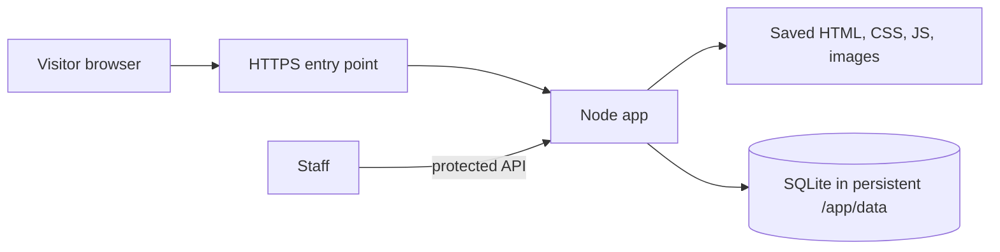

# Filfil site: learning and deployment journal

Last updated: 2026-09-16. This is a working notebook, not a claim that production is ready. We will add the output and lesson from each deployment step as we go. Do not put passwords, admin tokens, or private customer submissions in this file.

## What we have today

- The public site has been captured in `filfil-site/`. The latest mirror report lists **192 URL records**, mapping to **160 distinct saved HTML paths**, and **265 reported assets**. Some URLs differ only by a trailing slash and save to the same file.
- Recipe, magazine, and product “more” buttons work locally. Their full lists contain **86 recipes**, **37 articles**, and **19 products**. `static-list-report.json` shows no missing detail pages or list assets.
- `mirror-report.json` still records **20 source failures**: `/faqs/` returned HTTP 500, and 19 asset URLs returned HTTP 404, mostly fonts and a few icons/map images. These failures do not mean the whole capture failed.
- `Dockerfile` serves the read-only snapshot with Nginx. `Dockerfile.app` serves it through the Node backend and a fresh SQLite database in `/app/data`.
- The Node backend was tested locally with a temporary database: homepage, Persian search, contact form in a browser, product ratings, career attachment storage, and protected submission retrieval. The Docker image has **not** been built or tested here because this workspace cannot access the Docker socket.
- No production server has been inspected, no HTTPS or backups have been configured, and DNS has not been changed. Repo files currently appear untracked in Git; verify what will actually be transferred before deploying by Git.

## Mental model



The browser needs pages and assets to **view** the site. Submitting a form needs server code to receive and validate it. SQLite is where that code stores new records. A database alone does not make a form work. The HTTPS entry point handles certificates and forwards requests; DNS tells browsers which server to contact.

## Questions we resolved

| Earlier hypothesis or question | What the evidence showed | Practical lesson |
| --- | --- | --- |
| “I need the WordPress password to keep this site.” | The public HTTP endpoint reports an ASP.NET powered origin behind ArvanCloud. We cannot prove the entire origin setup from a header, but a WordPress login is not needed to serve a public snapshot. | Domain control and a copy of public content can replace the public site; neither recovers private source code or data. |
| “Downloading every page means every button works.” | The three “more” buttons called server endpoints. They returned 404 from a static file server until their responses were captured and the buttons were changed to reveal saved cards. | Audit actions as well as links when mirroring a dynamic site. |
| “`pnpm` exit code 1 means the download was lost.” | The crawler saved files and then exited nonzero because some individual requests failed. | Read `filfil-site/mirror-report.json`; distinguish the job's exit status from the amount of usable content. |
| “A Node or Flask server plus a DB automatically restores the old website.” | Old forms depended on search, comment, career, partner, rating, and CAPTCHA endpoints. | Each required behavior needs code. The new Node app implements fresh submissions and search, but does not recreate the old database. |
| “SQLite may be too small for a business website.” | This is a mostly read-only brand site with occasional lead submissions. SQLite documents low/medium-traffic websites as a good fit; it permits many readers but one writer at a time. | One app instance with SQLite on local persistent storage is reasonable here. Reconsider if multiple servers must write the same DB. [SQLite guidance](https://www.sqlite.org/whentouse.html) |
| “Building a container preserves its database.” | Container writable layers are disposable; a volume persists independently of the container. | Mount persistent storage at `/app/data` and test a restart. [Docker storage guide](https://docs.docker.com/engine/storage/) |
| “HTTPS and DNS are the same step.” | HTTPS is configured on the serving side; DNS only points a name to an address. | Test the app, storage, backups, and HTTPS before switching DNS. |

## Still incomplete or intentionally different

- New submissions are stored, but there is no staff inbox or email notification. Staff can use the protected API. For B2B leads, decide who checks it and how often before public launch.
- New product comments are saved privately; they are not published into the archived comment area. There is no moderation interface.
- The old career dynamic-field endpoint has an empty replacement, and the partner city dropdown is replaced with a free-text city field in the Node app.
- Spam controls are basic. The old CAPTCHA is not reused. Forms should be exercised on the production hostname before inviting real traffic.
- The `/faqs/` failure and source 404 assets are unresolved. Review their visible impact rather than assuming they are all critical.
- The static Nginx container does **not** process forms or search. Use the Node app container if those features matter.

## Deployment learning path

Complete one stage at a time. Record the actual result below before moving to the next stage.

1. [ ] **Inventory the host (in progress).** Ubuntu 26.04.1, Docker 29.1.3, and Compose 2.40.3 are present. Docker publishes ports 80/443. We still need the container names and restart policies. No changes yet.
2. [ ] **Prepare the app.** Build and run `Dockerfile.app` on a non-public test port; confirm homepage and forms.
3. [ ] **Persist SQLite.** Mount a local Docker volume at `/app/data`; submit a test record; recreate the container; confirm the record survives.
4. [ ] **Set the admin secret.** Provide a long random `FILFIL_ADMIN_TOKEN` without committing it to Git or putting it in this journal. Confirm the protected API rejects an unauthenticated request.
5. [ ] **Back up and restore.** Make a consistent SQLite backup, restore it into a separate test location, and read the test record there. A backup is proven only after a restore test. [SQLite backup guidance](https://www.sqlite.org/backup.html)
6. [ ] **Add HTTPS.** Use the host's existing proxy if one is present; otherwise choose one. Test the intended hostname and certificate while the old site is still available.
7. [ ] **Review business flows.** Submit test contact, partner, career, comment, and search requests. Decide how staff will see wholesale leads.
8. [ ] **Switch DNS.** Point the domain only after the new path works. Verify from outside the server, then keep a rollback path to the old destination during the transition.

### Step 1: host inventory in progress

Run on the intended production server over SSH:

```sh
cat /etc/os-release
docker version --format 'Docker server: {{.Server.Version}}'
docker compose version
sudo ss -ltnp '( sport = :80 or sport = :443 )'
```

These are read-only. An error is useful evidence too: for example, “permission denied” for Docker differs from “Docker is not installed.” Record the results below, omitting secrets.

The first run showed Ubuntu 26.04.1 LTS, Docker Engine 29.1.3, and Docker Compose 2.40.3. Ports 80 and 443 are held by `docker-proxy` on IPv4 and IPv6. This means a container is publishing those ports; it does **not** tell us which container or whether it will restart after a host reboot. The login banner also says a reboot is required. We have not rebooted.

Read-only follow-up before planning any reboot:

```sh
cat /run/reboot-required.pkgs 2>/dev/null || true
uname -r
systemctl is-enabled docker
docker ps --format 'table {{.Names}}\t{{.Status}}\t{{.Ports}}'
docker ps -q | xargs -r docker inspect --format '{{.Name}} restart={{.HostConfig.RestartPolicy.Name}}'
```

Ubuntu's reboot marker says an installed package wants a reboot to finish applying; zero pending package updates does not erase that requirement. A host reboot stops all containers for the duration. Whether each one returns automatically depends on Docker starting and its restart policy (`always` or `unless-stopped` normally restart; `no` does not). Check the actual policies before choosing a maintenance window. [Ubuntu update guidance](https://ubuntu.com/blog/ubuntu-updates-best-practices-for-updating-your-instance), [Docker restart policies](https://docs.docker.com/engine/containers/start-containers-automatically/).

## Step log

### 2026-09-16 — Host inventory, first pass

- **Expected:** Identify the server environment and current HTTP/HTTPS listener.
- **Observed:** Ubuntu 26.04.1 LTS; Docker 29.1.3; Compose 2.40.3; `docker-proxy` listening on 80/443 for IPv4 and IPv6. Login banner says restart required; no package updates currently pending.
- **What I revised:** “Restart required” means a package requested a reboot, not that we should reboot immediately. Docker being installed does not prove its containers will recover automatically.
- **Next:** Identify the affected packages, running containers, and their restart policies. Do not reboot during this learning step.

### Template for the next entry

```text
Date / stage:
What I expected:
What I ran or checked:
What actually happened:
What I misunderstood or revised:
Evidence (command output or link, no secrets):
Next small step:
```
